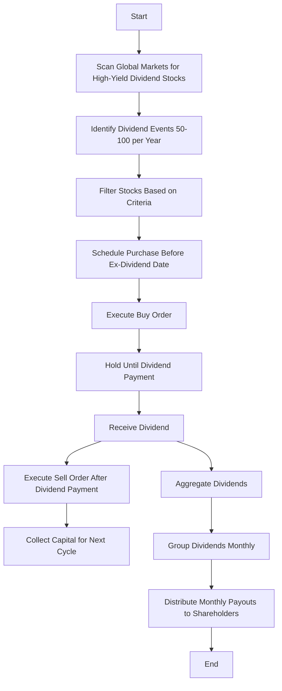
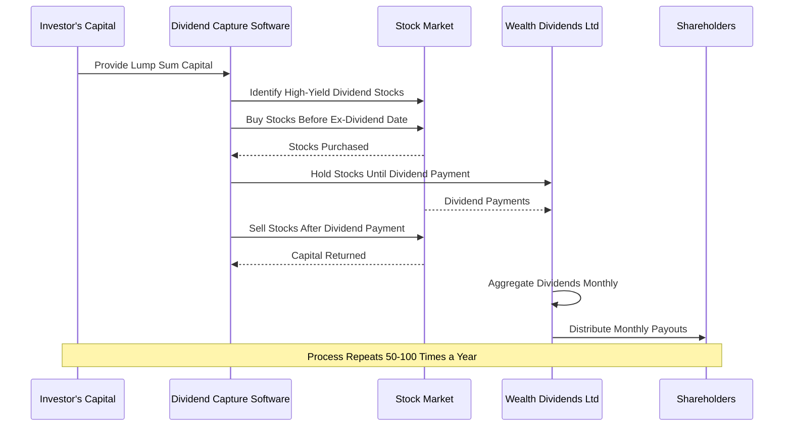
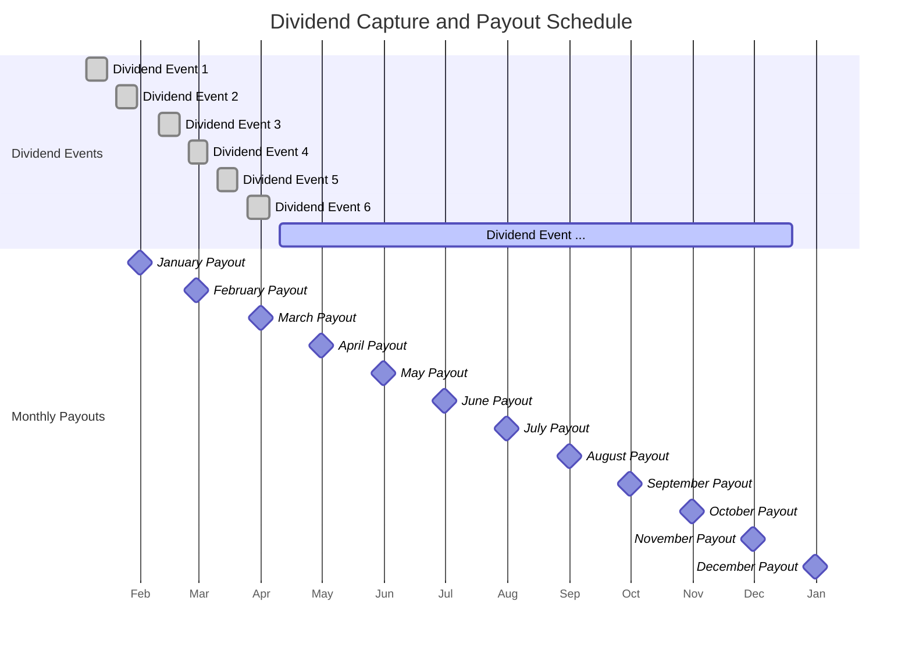
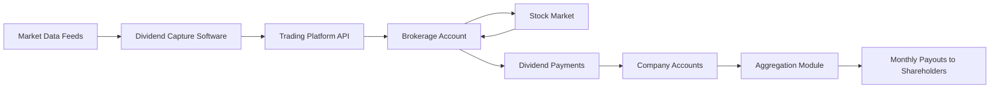
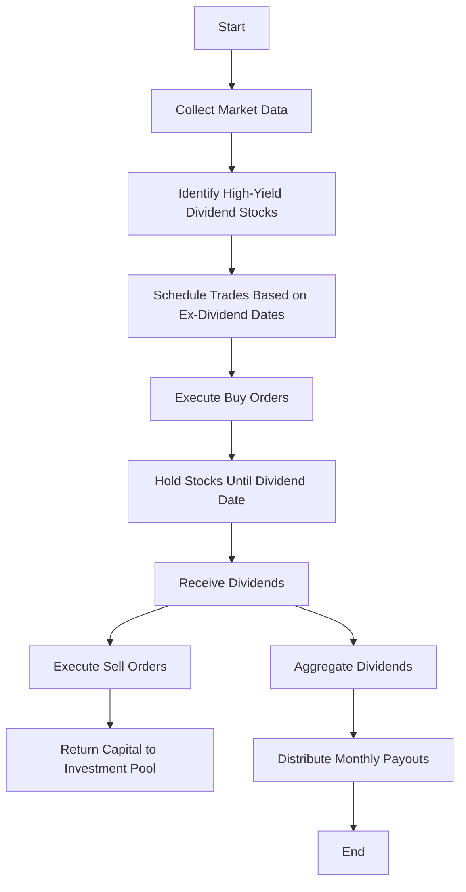
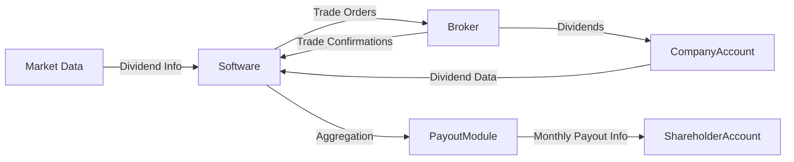

Diagrams for Wealth Dividends Ltd
=================================

1\. Software Design Diagram
---------------------------

This flowchart illustrates the software's operation, from scanning for dividend opportunities to distributing monthly payouts.

**Explanation:**

-   **A to B**: The software initiates and scans global markets for high-yield dividend stocks like BBVA.
-   **B to C**: Identifies 50-100 dividend events throughout the year.
-   **C to D**: Filters stocks based on criteria such as dividend yield, stability, and ex-dividend dates.
-   **D to E**: Schedules purchases to occur just before the ex-dividend date.
-   **E to F**: Executes the buy orders automatically.
-   **F to G**: Holds the stock until the dividend is paid.
-   **G to H**: Receives the dividend payment.
-   **H to I**: Sells the stock after the dividend is received.
-   **I to J**: Reclaims the capital to reinvest in the next dividend event.
-   **H to K**: Aggregates all dividends received.
-   **K to L**: Groups the aggregated dividends on a monthly basis.
-   **L to M**: Distributes the monthly payouts to shareholders.
-   **M to N**: The process continues in cycles throughout the year.

* * * * *

2\. Financial Transformation Diagram
------------------------------------

This sequence diagram shows how the initial capital is transformed into regular monthly payouts through the dividend capture process.

**Explanation:**

-   **Investor to Software**: The investor provides the initial lump sum capital.
-   **Software to Market**: The software identifies and purchases high-yield dividend stocks before their ex-dividend dates.
-   **Market to Software**: Confirms the purchase of stocks.
-   **Software to Company**: Holds the stocks until dividends are paid.
-   **Market to Company**: Issues dividend payments to Wealth Dividends Ltd.
-   **Software to Market**: Sells the stocks after receiving dividends.
-   **Market to Software**: Returns the capital from the sale.
-   **Company to Company**: Aggregates all dividends received on a monthly basis.
-   **Company to Shareholder**: Distributes the aggregated monthly payouts to shareholders.
-   **Process Repeats**: This cycle occurs 50-100 times per year to maximize dividend capture opportunities.

* * * * *

3\. Calendar Events Diagram
---------------------------

This Gantt chart displays the scheduling of dividend events and monthly payouts over a year.

**Explanation:**

-   **Dividend Events**: Represents multiple dividend capture events occurring throughout the year. Each event includes the purchase before the ex-dividend date and the sale after the dividend is received.
-   **Monthly Payouts**: Despite dividends being received at various times, they are aggregated and distributed to shareholders at the end of each month.

* * * * *

4\. High-Level Architecture Diagram
-----------------------------------

This diagram shows the components involved in the software and how they interact.

**Explanation:**

-   **Market Data Feeds**: Sources providing real-time stock and dividend information.
-   **Dividend Capture Software**: Core system processing data and making decisions.
-   **Trading Platform API**: Interface through which the software executes trades.
-   **Brokerage Account**: Holds the purchased stocks and funds.
-   **Stock Market**: Where the transactions occur.
-   **Dividend Payments**: Dividends received from the stocks held.
-   **Company Accounts**: Where dividends and capital are managed.
-   **Aggregation Module**: Collects all dividends received and prepares them for distribution.
-   **Monthly Payouts to Shareholders**: Final step where shareholders receive their payouts.

* * * * *

5\. Process Flow Diagram
------------------------

A detailed flowchart showing the end-to-end process of dividend capture and payout distribution.

**Explanation:**

-   **Start**: The process begins.
-   **Collect Market Data**: Software gathers necessary market information.
-   **Identify High-Yield Dividend Stocks**: Filters and selects suitable stocks.
-   **Schedule Trades**: Plans buying and selling around dividend dates.
-   **Execute Buy Orders**: Purchases stocks.
-   **Hold Stocks**: Waits until dividends are paid.
-   **Receive Dividends**: Company receives dividend payments.
-   **Execute Sell Orders**: Sells the stocks post-dividend.
-   **Return Capital**: Capital is returned to be used in the next cycle.
-   **Aggregate Dividends**: Dividends from various stocks are combined.
-   **Distribute Monthly Payouts**: Shareholders receive their monthly payments.
-   **End**: The process is continuous, looping back to the start.

* * * * *

6\. Data Flow Diagram (DFD)
---------------------------

Shows how data moves through the system.

**Explanation:**

-   **Market Data to Software**: Dividend and stock data feed into the software.
-   **Software to Broker**: Sends trade orders based on analysis.
-   **Broker to Software**: Confirms trades executed.
-   **Broker to Company Account**: Dividends are deposited.
-   **Company Account to Software**: Provides data on dividends received.
-   **Software to Payout Module**: Aggregates dividend data.
-   **Payout Module to Shareholder Account**: Processes monthly payouts.
